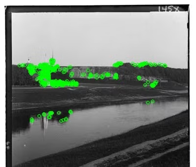
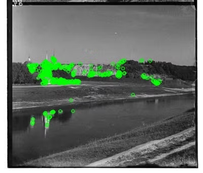
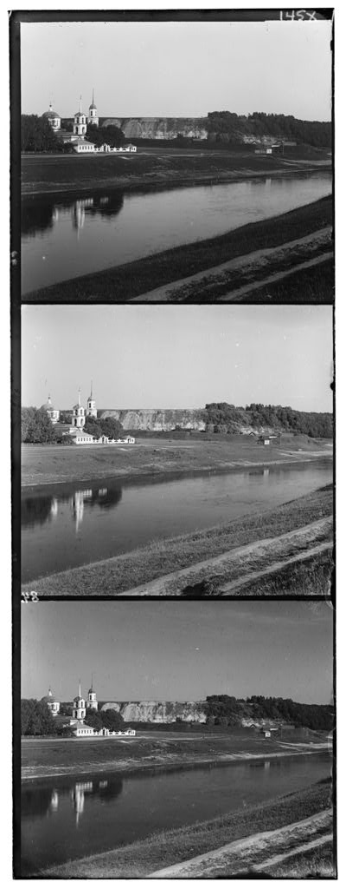
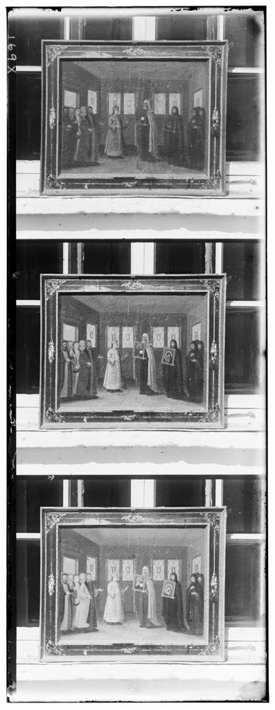
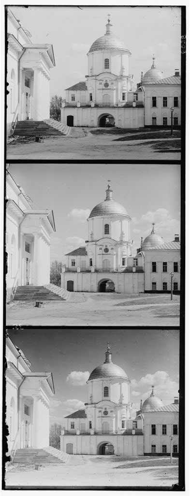
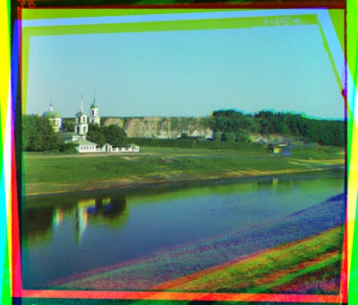
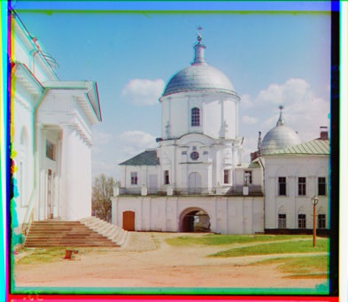
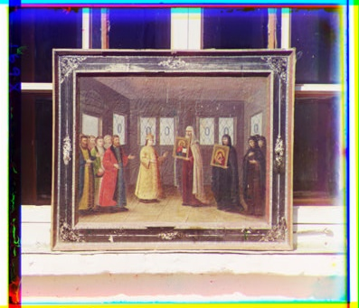

# Feature Matching & Alignment

***This class activity is to be done as individuals, not with partners nor with teams.***

### How to get started →

Begin by reading this entire writeup and making sure you have a good understanding of it. Next, spend some time planning how you’re going to approach the problem. 

# Introduction

---

In this class activity, you use OpenCV and Numpy to extract the three color channel images, place them on top of each other, and align them so that they form a single RGB color image with as few visual artifacts as possible.

#### Prokudin-Gorskii Photo Collection
Sergei Mikhailovich Prokudin-Gorskii was a photographer who traveled the Russian Empire between 1909 and 1915, taking thousands of photos using an early color technology that involved recording three exposures of every scene onto a glass plate using a red, green, and blue filter. His glass plate negatives survived and were purchased by the Library of Congress in 1948. Today, a digitized version of the Prokudin-Gorskii collection is available online.

>**Note: You will not need ROS for this activity. While you may use the virtual machine, you are free to use your own development environment.**

# Activity Information

---

### Objectives

- Understand how feature extraction works
- Use OpenCV and Numpy to extract and align color channels
- Understand how to use feature matching to align images

### Resources

- [OpenCV](https://docs.opencv.org/4.x/index.html)
- [Installing opencv](https://opencv.org/get-started/)
- [OpenCV Python](https://docs.opencv.org/4.x/d6/d00/tutorial_py_root.html)
- [ORB Features](https://docs.opencv.org/3.4/d1/d89/tutorial_py_orb.html)
- [Arg parser](https://docs.python.org/3/library/argparse.html)

### Requirements

- Your python code should execute without errors
- Your script should not require any additional packages to be installed
- Your code should be well documented

### What we provide

- Template code and instructions to align images
- Sample images to test your code
- Sample output images (in the `results` folder)

Images are provided in the `images` folder. You will need to align the images using the `align.py` script. The script should read the images, extract the color channels, and align them to form a single RGB image and save the RGB image.

Sample images have 3 images vertically stacked. The top image is the blue channel, the middle image is the green channel, and the bottom image is the red channel. You will need to extract the color channels and align them to form a single RGB image.


### What to submit

```bash
feature_matching
├── images
│   └── test_image_1.png
│   └── test_image_2.png
│   └── test_image_3.png
├── results
│   └── test_aligned_1.png
│   └── test_aligned_2.png
│   └── test_aligned_3.png
└── align.py
└── image-1.png
└── image.png
```

Your code should accept the input image directory and output directory as command-line arguments. The output directory should contain the aligned images. Use argeparse to parse the command-line arguments and OS to handle file paths.

Example command to run the script: `python3 align.py --input images --output results`. (Use python's argparser for it [here](#resources))

*Please make sure you adhere to the structure above, if your package doesn’t match it the grader will give you a **zero***

### Grading considerations

- **Late submissions:** Carefully review the course policies on submission and late assignments. Verify before the deadline that you have submitted the correct version.
- **Environment, names, and types:** You are required to adhere to the names and types of the functions and modules specified in the release code. Otherwise, your solution will receive minimal credit.

## Feature Matching & Alignment
---

### ORB Features

ORB (Oriented FAST and Rotated BRIEF) is a feature detection and description algorithm commonly used in computer vision tasks. It combines the features of the FAST (Features from Accelerated Segment Test) keypoint detector and the BRIEF (Binary Robust Independent Elementary Features) descriptor.

Key features of ORB include:

1. **Rotation Invariance**: ORB is able to detect and match features even when the image is rotated, making it robust to changes in the orientation of the scene.
2. **Scale Invariance**: ORB can detect features at multiple scales, allowing it to match features even when the size of the object or scene varies.
3. **Efficiency**: ORB is computationally efficient and can be applied to real-time applications.

The ORB algorithm works by first identifying keypoints in an image using the FAST algorithm. These keypoints are then described using binary strings generated by the BRIEF descriptor. The binary strings capture the local intensity patterns around the keypoints, providing a compact representation of the features.

In the context of image alignment, we will use ORB features to detect corresponding features between different color channels. By matching the ORB features and estimating the transformations needed to align the channels, we can accurately align images.

Below you can see ORB features overlayed on one of the test images.




### Code

In the `align.py`, you must write your alignment code within the `align_images` function and strictly adhere to the function specification.

`def align_images(r: np.ndarray, g: np.ndarray, b: np.ndarray) -> np.ndarray:`

The function takes input red, green and blue channels and returns and aligned image. Although we provide a `split_helper` function to help split the image into 3 channels you may write your own.

>### The template has `assert` statements, please do not remove them. You may add your own if required.

### Grading

**Before grading, we will delete all files inside the `results` folder**. The command `python3 align.py --input images --output results` will be run. Upon running, your code should save the output aligned images. If the images are RGB images (but not aligned) you will receive 35% (Naive stacking). If your outputs are aligned you will get 100% (Proper alignment). If your code saves a grayscale image or does not save at all, you will get a 0%. 

>The input images can have arbitrary sizes. Do not hardcode any sizes.

# Sample Images and Expected Output
---

### Sample Images

Test Image 1             |  Test Image 2  |  Test Image 3 
:-------------------------:|:-------------------------:|:-------------------------:
  |   | 


### Expected Output
Result 1             |  Result 2  |  Result 3 
:-------------------------:|:-------------------------:|:-------------------------:
  |   | 


# Submission and Assessment

---

Submit your code using the Github upload feature on [autolab](https://autolab.cse.buffalo.edu). 

**Note: Make sure your code complies to all instructions, especially the naming conventions. Failure to comply will result in zero credit.**

You will be graded on the following. Penalties are listed under each point, absolute values, w.r.t activity total.

1. Naive frame stacking (35%)
2. Proper alignment (65%)
